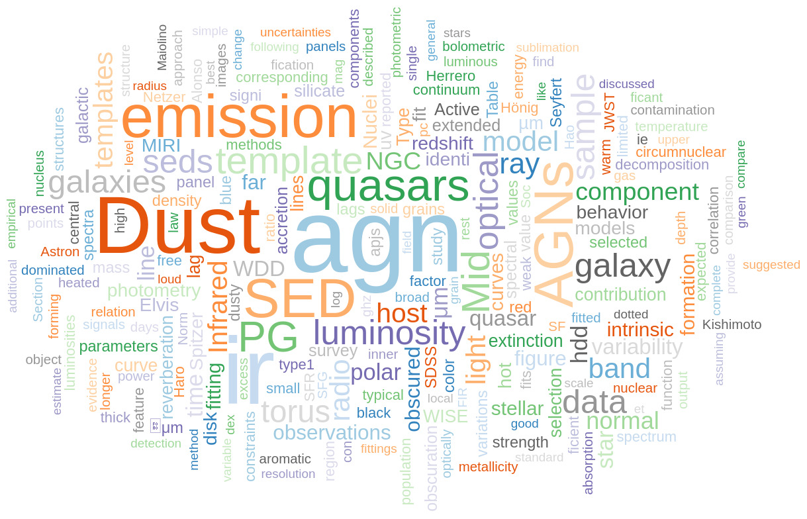

(under construction)

quasars and AGN in the early Universe
======

AGN demographics across cosmic time
======

AGN obscuration structures and IR properties
======

AGN-galaxy co-evolution
======

IR time-domain astronomy
======

Dust, PAH and star formation
======
